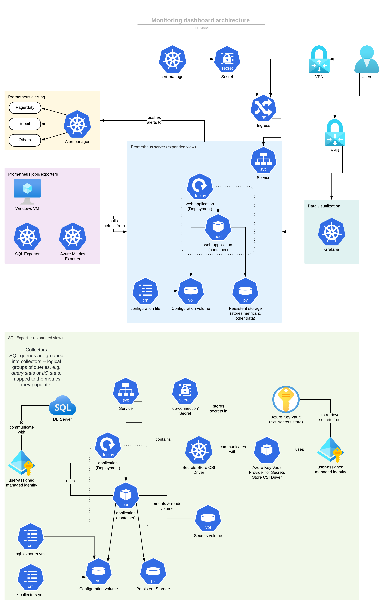

One of the reasons I was hired at one of my past jobs was to create an observability/monitoring solution to replace their current system. Being familiar with Kubernetes, Prometheus and Grafana, I decided to build a solution using (among others), these three components!

Below is the architecture diagram of what I designed and implemented, (albeit slightly modified for removal of intellectual property).

{:target="_blank"}
